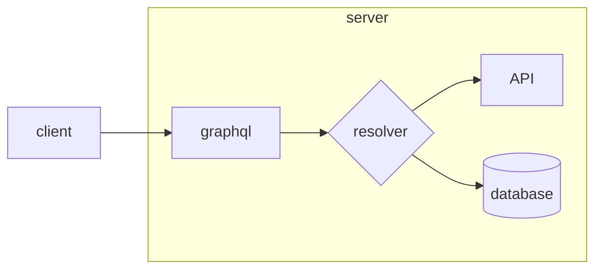

### Introduction

This project aims a simple implementation of graphql
at [Golang language](https://go.dev/) and using [gqlgen](https://gqlgen.com/getting-started/) to generate
schemas, model and resolvers.


Graphql has a similar behavior as BFF. It is a server where it is possible to gather from 
different sources and build it, according to its query.



### Requirements

* [GOLANG](https://go.dev/) >1.16


### How to run

``` shell
### Install dependencies
go mod tidy

### Run server

go run server

```
Afterward you run application, a local client is 
generated at localhost:8080 where you are able to query
entities or insert new data throughout mutations.


### Examples

```grahql

### Creating a category
mutation createCategory{
  createCategory(input:{
    name:"PHP",
    description: "PHP is AWESOME"
  }){
    id
    name
    description
  }
}

### Find a category

query findCategories{
  categories{
    name
    description
    courses{
      name
    }
  }
}

```

